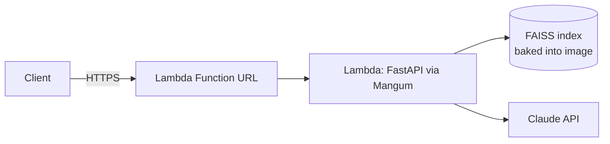

# FinSight RAG

Multi-agent Retrieval-Augmented Generation system for financial document
intelligence over SEC filings (10-K/10-Q/8-K).

**Status:** Phases 1-5 of 6 done and **fully live**, including LLM
generation — **try it now:**

```bash
curl -X POST https://f6clgh5gp5wsg4ty3hb4qqezxe0rtwho.lambda-url.us-east-2.on.aws/query \
  -H "Content-Type: application/json" \
  -d '{"query": "What is Costco'"'"'s core business?"}'
```

See [finsight-rag-claude-code-prompt_1.md](finsight-rag-claude-code-prompt_1.md)
for the full build spec and phase plan.

## Phase 1 — Data ingestion & chunking (done)

Pulls real 10-K filings for 8 companies across 3 sectors straight from SEC
EDGAR's free public APIs (no API key required), parses them into standard
Item sections, and chunks them with metadata for retrieval.

| Sector | Tickers |
|---|---|
| Technology | AAPL, MSFT, NVDA |
| Financials | JPM, GS |
| Consumer Retail | WMT, COST, TGT |

Each company's 2 most recent 10-Ks are pulled (enables period-over-period
comparison queries), giving **14 filings and ~3,600 chunks** in the current
corpus.

**Storage tradeoff:** raw HTML and chunked JSONL are written to local disk
(`data/raw/`, `data/processed/`). That's fine at this scale; at production
scale this would move to S3 for the raw/chunk store with the manifest in a
real database, so ingestion workers don't need a shared filesystem.

### Run it

```bash
python -m venv .venv
./.venv/Scripts/activate   # or source .venv/bin/activate on macOS/Linux
pip install -r requirements.txt   # or just the ingestion subset for Phase 1
python scripts/ingest.py
```

Output:
- `data/raw/<TICKER>_<accession>.html` — raw filing HTML
- `data/processed/chunks.jsonl` — one JSON object per chunk, with `ticker`,
  `sector`, `filing_type`, `filing_date`, `accession_number`, `section_key`,
  `section_title`, `source_url`, `chunk_id`, `text`
- `data/processed/manifest.json` — one entry per filing ingested

### Tests

```bash
python -m pytest tests/ -v
```

7 tests covering HTML→text conversion, entity decoding, section splitting
(including the no-headings-found fallback), chunk metadata correctness, and
EDGAR API response filtering (mocked, no live network dependency in CI).

## Phase 2 — Embeddings & vector store (done)

Benchmarks two open-source embedding models against a 16-query hand-labeled
eval set, indexes chunks into FAISS, and logs everything to MLflow so the
model choice is backed by numbers, not a guess.

**Models compared** (both small enough to run on CPU in a few minutes):

| Model | HF name | Dim | Notes |
|---|---|---|---|
| BGE-small | `BAAI/bge-small-en-v1.5` | 384 | No instruction prefix needed (v1.5) |
| E5-small | `intfloat/e5-small-v2` | 384 | Requires `"query: "`/`"passage: "` prefixes per its model card — implemented in [sentence_transformer.py](src/finsight/embeddings/sentence_transformer.py) |

An OpenAI model (`text-embedding-3-small`) was in the original plan but
dropped to keep this phase key-free — both candidates here are fully
open-source and run locally.

**Eval methodology:** 16 hand-labeled queries ([queries.py](src/finsight/eval/queries.py)),
each labeled with the expected `(ticker, section)` and keywords the answer
should contain. For each query, both models retrieve top-5 chunks from their
own FAISS index over the full ~3,600-chunk corpus; we measure whether the
correct ticker+section shows up (`hit_rate@5`), how high it ranks (`MRR`),
and whether the retrieved text contains the expected keywords regardless of
exact section match (`keyword_hit_rate@5`).

**Results** (MLflow experiment `finsight-embedding-benchmark`, tracked in
`mlflow.db`):

| Model | hit_rate@5 | MRR | keyword_hit_rate@5 |
|---|---|---|---|
| bge-small | 0.5625 | 0.5313 | **1.0000** |
| e5-small | **0.6250** | **0.5365** | 0.9375 |

**Pick for production: e5-small.** It retrieves the exact expected
ticker+section more often and ranks it slightly higher on average, which
matters more than keyword recall for the Filing Q&A and Comparison agents in
Phase 3, which depend on the retrieved chunk being from the *right* filing
section. bge-small's perfect keyword hit rate suggests it's better at
surfacing topically-relevant text even when it picks the "wrong" section —
worth revisiting if Phase 4's RAGAS faithfulness scores disagree with this
call. With only 16 queries the margin (10/16 vs 9/16 correct) is a single
query wide, so this is a soft pick, not a landslide — noted honestly rather
than overstated.

**Vector store:** FAISS (`IndexFlatIP` over L2-normalized vectors = cosine
similarity) is the dev default — exact search is fine at ~3,600 chunks.
Pinecone ([pinecone_store.py](src/finsight/vectorstore/pinecone_store.py))
is the "production" path behind the same `VectorStore` interface, unit-tested
against a mocked client from the start, and **since verified live**: all
3,616 chunks were embedded (e5-small) and upserted to a real serverless
Pinecone index, and a live query for "Apple's main supply chain risks"
correctly surfaced Apple's actual Risk Factors language (same result
quality as the FAISS path). Swap via `VECTOR_STORE=pinecone` in `.env`.

### Run it

```bash
python scripts/run_embedding_benchmark.py
```

Output:
- `data/indexes/<model_key>/index.faiss` + `meta.jsonl` — persisted FAISS index per model
- `data/processed/embedding_benchmark.json` — comparison summary
- MLflow runs in `mlflow.db` (`mlflow ui --backend-store-uri sqlite:///mlflow.db` to view)

### Tests

22 new tests (29 total) covering: FAISS upsert/query/save/load round-trips,
retrieval metric correctness (hit@k, MRR, keyword matching), embedding
prefix logic (mocked model, no weight download in CI), the Pinecone wrapper
(mocked client — batching, index-creation-if-missing, response mapping), and
the FAISS/Pinecone factory dispatch.

## Phase 3 — Multi-agent orchestration (done, live)

A LangGraph `StateGraph` router: a router node classifies the incoming
question via Claude tool-calling and a conditional edge dispatches to one of
four specialist nodes. Follows the same design principle as a separate
voice-assistant project: **the LLM proposes, the backend disposes** — the
router LLM call picks a tool and fills in its arguments, then plain
deterministic Python does the retrieval and dispatch. See
[graph.py](src/finsight/agents/graph.py).

**Specialist agents**, each with a narrow, explicit input schema
([router_tools.py](src/finsight/agents/router_tools.py)) rather than a
free-form prompt:

| Agent | Input | Retrieval strategy |
|---|---|---|
| `filing_qa` | `ticker`, `question` | similarity search, filtered to that ticker |
| `comparison` | `tickers[]`, `topic` | similarity search per ticker, merged |
| `risk_flag` | `ticker` | similarity search filtered to `item1a` (Risk Factors) |
| `summarization` | `ticker`, `section_key` | **full section**, not similarity search — a summary needs complete coverage, not just the chunks most similar to a query ([corpus.py](src/finsight/retrieval/corpus.py)) |

**Vendor abstraction:** agents call a common `LLMProvider.complete()`
interface ([llm/base.py](src/finsight/llm/base.py)); Anthropic (Claude) is
primary, OpenAI is wired in behind the identical interface
([llm/openai_provider.py](src/finsight/llm/openai_provider.py)), swappable
via `LLM_PROVIDER=openai` in `.env` — same pattern as the FAISS/Pinecone
swap in Phase 2.

**Routing-decision logging:** every routed query is appended to
`data/processed/routing_log.jsonl` (query, chosen agent, extracted args,
timestamp) — the raw material for a routing-accuracy metric in Phase 4.

### Verified live end-to-end

Once an `ANTHROPIC_API_KEY` was added, the whole pipeline ran for real with
no code changes — exactly as designed. Example, verbatim from a live run:

> **Query:** "What are Apple's main risk factors?"
> **Routed to:** `risk_flag`
>
> *"...New and evolving laws, executive orders, and enforcement priorities
> pose increasing risk as Apple expands into specialized applications such
> as health and financial services, and as it broadens use of machine
> learning and AI features... New and changing regulations on online
> safety, minor protections, and mandatory age verification are called out
> as increasing regulatory risk..."*
>
> **Citations:** AAPL Risk Factors (2024-11-01), AAPL Risk Factors (2025-10-31)

The retrieval layer was already verified live in an earlier pass with no
LLM key needed (`scripts/demo_retrieval.py` — ticker/section-filtered
search and full-section lookup against the real FAISS index); this
confirms the routing + generation half on top of it.

### Run it

```bash
# No API key needed - proves the retrieval/data layer
python scripts/demo_retrieval.py

# Needs ANTHROPIC_API_KEY in .env - runs the full live pipeline
python scripts/run_query.py "What are Apple's main risk factors?"
```

### Tests

56 tests total (27 new): LLM provider request/response mapping for both
Anthropic and OpenAI (mocked clients, including tool-schema translation
between the two), the LLM provider registry swap, the retriever's
ticker/section filtering (synthetic FAISS store, deterministic fake
embedding model), the full-section corpus lookup, each of the 4 specialist
agent functions (mocked LLM + retriever, asserting correct retrieval calls
and citation building), and the LangGraph wiring itself — routing dispatch,
decision logging, and the no-tool-call error path.

## Phase 4 — Evaluation framework (done, live)

A 24-case hand-labeled eval set ([agent_cases.py](src/finsight/eval/agent_cases.py)),
6 cases per specialist agent, covering all 8 ingested companies. Every
`expected_answer` and keyword set is grounded in real excerpts pulled live
from the indexed corpus while building the set — not guessed at (one case's
keywords were initially wrong for exactly this reason: see below).

**Two things get measured per case:**
1. **Routing accuracy** — does the router pick the case's labeled `agent`? ([routing_eval.py](src/finsight/eval/routing_eval.py))
2. **RAGAS-methodology metrics** — faithfulness, answer relevancy, context precision, context recall ([ragas_metrics.py](src/finsight/eval/ragas_metrics.py))

### Results — live run, 24 cases, logged to MLflow (`finsight-agent-evaluation`)

| Metric | Score |
|---|---|
| Routing accuracy | 0.792 (19/24) |
| Faithfulness | 0.663 |
| Answer relevancy | 0.792 |
| Context precision | 0.535 |
| Context recall | 0.860 |

**On the 5 routing misses:** all five are `filing_qa` cases the router sent
to `risk_flag` or `summarization` instead — not random noise. Questions like
*"What are Apple's main supply chain risks?"* and *"What is Goldman Sachs'
business overview?"* are genuinely ambiguous: they're phrased as direct
questions (which should route to `filing_qa`) but their subject matter
overlaps heavily with what `risk_flag` and `summarization` exist to handle.
Claude's routing choice is defensible in each case — this reads as an eval
set construction issue (questions phrased with risk/overview language) more
than a router defect, and would be the first thing to revisit before
trusting this number at face value.

**On context precision (0.535, the lowest score):** the `Retriever`
over-fetches a large candidate pool per query and returns the top-k after
filtering (see Item 3 / [retriever.py](src/finsight/retrieval/retriever.py)),
which trades some precision for recall — consistent with recall (0.860)
scoring well above precision here. A tighter top-k or a reranking pass
would be the natural next lever.

### Why not the `ragas` package

`ragas` was the spec's stated choice and was actually installed and tried
first. It broke on import: `ragas.llms.base` unconditionally imports a
deprecated `langchain_community.chat_models.vertexai` shim that current
`langchain-community` no longer ships. Pinning an old enough
`langchain-community` to get the shim back drags `langchain-core` below
what LangGraph 1.x requires — which **broke Phase 3** the first time this
was tried (caught immediately by rerunning the test suite, then reverted).

Rather than fight that conflict, the four RAGAS metrics are implemented
natively against the same `LLMProvider` abstraction Phase 3 already built:
each metric is one LLM call with a `submit_score` tool (0.0-1.0), reusing
the router's tool-calling infrastructure instead of parsing free-text
scores. This sidesteps the conflict entirely and stays consistent with the
project's existing vendor-abstraction pattern. **TruLens** was the
spec-requested alternative to note: it leans toward live tracing /
feedback-function instrumentation inside a running app, which fits
production observability better than the batch, dataset-style evaluation
this project needed (matching the Phase 2 benchmark's methodology).

### Retrieval-only check (no LLM needed)

`scripts/run_agent_retrieval_check.py` runs the exact retrieval each
specialist agent would use for all 24 cases and checks the expected
keywords actually show up: **24/24 (100%) hit rate.** One case initially
failed this check — `cmp-aapl-msft-cybersecurity` was labeled with keywords
`("apple", "microsoft")`, but 10-K body text refers to the filer as "the
Company," not by name, so the literal company-name keywords never matched
even though the retrieved content was clearly correct. Fixed by rechecking
the actual retrieved text and relabeling with keywords grounded in it
(`"data security"`, `"outages"`) — a small, real example of why the eval
set was built by inspecting live retrieval output rather than guessing
content.

### Run it

```bash
# No API key needed
python scripts/run_agent_retrieval_check.py

# Needs ANTHROPIC_API_KEY in .env - runs the full live eval + logs to MLflow
python scripts/run_agent_eval.py
```

### Tests

81 tests total (25 new): the eval-case set's own shape/schema sanity
checks, the 4 RAGAS-methodology metric functions (mocked LLM judge,
including the empty-context and no-tool-call-returned edge cases), the
routing-accuracy evaluator, the full combined eval orchestration
(single-graph-invoke-per-case, aggregate averaging, routing-correctness
flagging), and the retrieval-check dispatch logic for all 4 agent types
(synthetic FAISS store, monkeypatched corpus lookup for summarization).

## Phase 5 — API + deployment (done, live on AWS)

FastAPI service exposing `/health`, `/filings`, `/query` (full router), and
`/compare` (dedicated comparison endpoint — bypasses routing since the
client already knows it wants a comparison). Containerized with Docker and
**actually deployed and reachable**, not left as instructions:

**Live endpoint:** https://f6clgh5gp5wsg4ty3hb4qqezxe0rtwho.lambda-url.us-east-2.on.aws/

```bash
curl https://f6clgh5gp5wsg4ty3hb4qqezxe0rtwho.lambda-url.us-east-2.on.aws/health
curl https://f6clgh5gp5wsg4ty3hb4qqezxe0rtwho.lambda-url.us-east-2.on.aws/filings

curl -X POST https://f6clgh5gp5wsg4ty3hb4qqezxe0rtwho.lambda-url.us-east-2.on.aws/query \
  -H "Content-Type: application/json" -d '{"query": "What is Costco'"'"'s core business?"}'
```

All four endpoints are fully live — `/query` and `/compare` run the real
router and LLM generation against the deployed Lambda, not a stub. If they
ever 503, it means the `ANTHROPIC_API_KEY` environment variable on the
Lambda function has been removed or expired; `/health`'s `llm_configured`
field reports this directly.

### Architecture: AWS Lambda (container image) + Function URL



- **`Dockerfile`** — generic image (plain `python:3.12-slim` + uvicorn), for local runs or an ECS/Fargate-style deployment
- **`Dockerfile.lambda`** — separate image on AWS's Lambda Python base, since Lambda needs its Runtime Interface Client invoking a per-event handler ([`lambda_handler.py`](src/finsight/api/lambda_handler.py) via Mangum), not a persistent server — genuinely different image shape, not just a different `CMD`
- Both images bake in the Phase 1/2 outputs (chunk corpus, FAISS index, **and now the e5-small model weights**) at build time so the container is self-contained — no first-request download, no ingestion-on-boot

### Real problems hit and fixed during this deployment

Documenting these because they're the actual engineering content of this
phase — a deploy that "just worked" would be less defensible in an
interview than one where I can explain what broke and why:

1. **8.76GB image, most of it unused.** `pip install sentence-transformers` pulled the default PyPI `torch` wheel, which bundles ~1.5GB of NVIDIA CUDA libraries this project never uses (CPU-only embeddings). Fixed by installing `torch` from the CPU-only index first (`--index-url https://download.pytorch.org/whl/cpu`) before the rest of `requirements-api.txt` — image dropped to 2.22GB.
2. **API Gateway's hard 29-second timeout.** First deployment target was an API Gateway HTTP API in front of Lambda. Cold start (loading the embedding model) took ~40s, so API Gateway killed the request before Lambda even finished initializing — this cap applies regardless of Lambda's own configured timeout. Switched to a **Lambda Function URL**, which has no such ceiling.
3. **Cold-start crash: read-only filesystem.** Even after fixing the timeout, the Lambda kept crashing on init with `OSError: [Errno 30] Read-only file system`. `sentence-transformers` was trying to download/verify the model from HuggingFace Hub on every cold start (only the FAISS index was baked into the image, not the model weights itself), and Lambda's default HF cache path sits under a read-only sandboxed home directory. Fixed by baking the model weights into the image at build time under a fixed `HF_HOME=/opt/hf_cache`, so no network call or write attempt happens at runtime. Cut cold start from ~40s to ~18s as a side benefit.
4. **403 Forbidden on a correctly-configured public Function URL.** `AuthType=NONE` plus a resource policy granting `lambda:InvokeFunctionUrl` to principal `*` still returned 403 — confirmed by deleting and recreating the URL and permission from scratch (twice) with no change. Root cause: AWS changed the requirement in **October 2025** — public Function URLs now need **both** `lambda:InvokeFunctionUrl` *and* `lambda:InvokeFunction` granted in the resource policy, not just the former. Adding the second permission fixed it immediately.

### Documented alternative: ECS/Fargate or SageMaker

Lambda was chosen as the "lightweight path" per the spec, and it's what's
actually live. For a "real" production deployment at higher, steadier
traffic, the tradeoffs point elsewhere:

- **ECS/Fargate** would use the plain `Dockerfile` image (already built and tested) behind an Application Load Balancer — no cold starts, no 29s/Lambda-specific constraints, better fit for sustained traffic. Steps: push the same non-Lambda image to ECR (already done), create an ECS cluster + Fargate service + target group + ALB, point DNS at the ALB. Not deployed here to keep AWS spend and moving parts minimal for a portfolio project — the container is proven to work standalone (see Phase 5 local Docker testing).
- **SageMaker** endpoints are built for serving trained ML models (classification/regression) behind a managed, autoscaling inference endpoint — a natural fit if this project's embedding model were fine-tuned rather than used off-the-shelf. Since the embedding models here are pretrained and unmodified, a SageMaker real-time endpoint would mostly add cost and complexity over the Lambda/ECS path without a corresponding benefit; noted here as the documented alternative per the original spec rather than actually built.

### Run it

```bash
# Local, no Docker - PYTHONPATH=src is required, the package isn't pip-installed
PYTHONPATH=src python -m uvicorn finsight.api.app:app --reload

# Local, containerized (same image logic as what's deployed)
docker build -t finsight-rag-api:local .
docker run -p 8000:8000 finsight-rag-api:local
curl http://localhost:8000/health
```

### Tests

90 tests total (9 new): `/health`, `/filings`, `/query`, `/compare`, request
validation (empty query, single-ticker compare), the 503-without-LLM path
for both LLM-dependent endpoints, and that `/compare` calls the comparison
agent directly rather than going through the router — all against a real
FastAPI `TestClient` with mocked LLM/retriever dependencies injected via
`monkeypatch`, not a hand-rolled request stub.

## Coming next

- **Phase 6** — full docs, CI/CD, demo script
